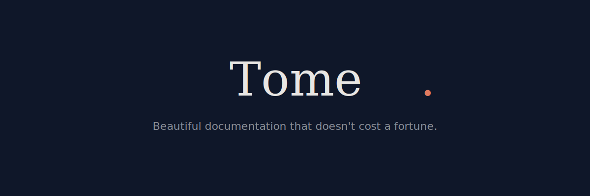

<p align="center">
  
</p>

<p align="center">
  <a href="https://github.com/tomehq/tome/blob/main/LICENSE"></a>
  <a href="https://github.com/tomehq/tome/actions"></a>
</p>

---

Tome is an open-source documentation platform for developers. Write Markdown, get a beautiful docs site. Self-host for free or deploy to Tome Cloud.

## Quickstart

```bash
npx create-tome my-docs
cd my-docs
npm run dev
```

That's it. Open [localhost:3000](http://localhost:3000) to see your docs.

## Why Tome?

| | Tome | Mintlify | Docusaurus |
|---|---|---|---|
| **Self-host** | Free forever | No | Free |
| **Managed hosting** | $19/mo | $300+/mo | No |
| **Unlimited sites** | Yes | $300 each | Manual |
| **API ref (OpenAPI)** | Built-in | Built-in | Plugin |
| **Search** | Pagefind + Algolia | Built-in | Algolia |
| **Setup time** | ~2 min | ~5 min | ~30 min |
| **Vendor lock-in** | None | Moderate | None |

## Features

- **Markdown & MDX** — Write docs in Markdown with React components
- **Syntax highlighting** — Shiki with every language and theme
- **Built-in search** — Pagefind (local) or Algolia DocSearch
- **API references** — Auto-generate from OpenAPI specs with interactive playground
- **Theming** — Full CSS control, dark/light mode, 6 built-in presets
- **Content sources** — Pull docs from GitHub repos, Notion databases, or custom APIs
- **Deploy anywhere** — Static output for Vercel, Netlify, S3, or self-host
- **AI chat** — Embedded AI assistant with BYOK (OpenAI + Anthropic)
- **MCP server** — Machine-readable output for AI tools
- **TypeDoc** — Generate API reference pages from TypeScript source
- **i18n** — Multi-language support with locale directories
- **Versioning** — Multi-version docs with version switcher
- **Analytics** — Privacy-first, no cookies, <1KB script
- **Custom domains** — Full DNS management with SSL
- **CI/CD auto-deploy** — Scaffolded GitHub Actions workflow, preview deploys on PRs
- **Migrate from GitBook / Mintlify** — One-command migration with syntax conversion
- **Redirects** — Config-level and per-page frontmatter redirects
- **Preview deployments** — Branch-based preview URLs for PR review
- **Webhooks** — Slack, Discord, and HTTP notifications for deploy events
- **MDX sandbox** — Build-time AST analysis blocks dangerous JS patterns in MDX
- **OG images** — Auto-generated social preview cards at build time
- **Content linting** — Validate heading structure, alt text, paragraph length, and more
- **Broken link checker** — Catch dead internal links during build
- **Changelog pages** — Parse Keep a Changelog format with filtering and color coding
- **Git-based dates** — Auto-display "Last updated" from git history
- **Plugin system** — Extend Tome with custom build hooks and Vite plugins

## CLI

```
tome init [name]              Scaffold a new docs project (includes CI/CD workflow)
tome dev                      Start the dev server
tome build                    Build static site for production
tome deploy                   Deploy to Tome Cloud
tome deploy --preview         Deploy a branch preview
tome migrate gitbook <dir>    Migrate from GitBook
tome migrate mintlify <dir>   Migrate from Mintlify
tome lint                     Lint content for common issues
tome login                    Authenticate with Tome Cloud
tome typedoc <files...>       Generate API docs from TypeScript source
tome mcp                      Start MCP server for AI tools
tome algolia:init             Generate Algolia DocSearch config
tome domains:add              Add a custom domain
tome domains:remove           Remove a custom domain
tome domains:list             List configured domains
tome domains:verify           Check DNS verification status
```

## Configuration

Create a `tome.config.js` (or `.ts`) in your project root:

```js
import { defineConfig } from "@tomehq/core";

export default defineConfig({
  name: "My Docs",
  theme: { preset: "amber" },
  search: { provider: "local" }, // or "algolia"
  // Optional
  analytics: { provider: "plausible", key: "your-site-id" },
  redirects: [
    { from: "/old-page", to: "/new-page" },
  ],
  webhooks: [
    { url: "https://hooks.slack.com/...", channel: "slack" },
  ],
  i18n: { defaultLocale: "en", locales: ["en", "ja"] },
  versioning: { versions: ["v1", "v2"], current: "v2" },
});
```

## Documentation

Visit [tome.center/docs](https://tome.center/docs) for the full documentation.

## Packages

| Package | Description |
|---|---|
| [`@tomehq/core`](./packages/core) | Config, routes, markdown processing, deploy, billing, webhooks, linting |
| [`@tomehq/cli`](./packages/cli) | Command-line interface |
| [`@tomehq/theme`](./packages/theme) | Default theme with Shell, AiChat, presets |
| [`@tomehq/components`](./packages/components) | MDX components (Callout, Tabs, Card, Steps, Accordion, API) |
| [`@tomehq/dashboard`](./packages/dashboard) | Cloud dashboard (projects, billing, settings) |
| [`@tomehq/landing`](./packages/landing) | Marketing landing page |
| [`create-tome`](./packages/create-tome) | Project scaffolding (`npx create-tome`) |

## Contributing

See [CONTRIBUTING.md](./CONTRIBUTING.md) for development setup and guidelines.

## License

MIT © [Tome Contributors](https://github.com/tomehq/tome/graphs/contributors)
