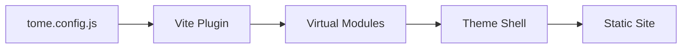
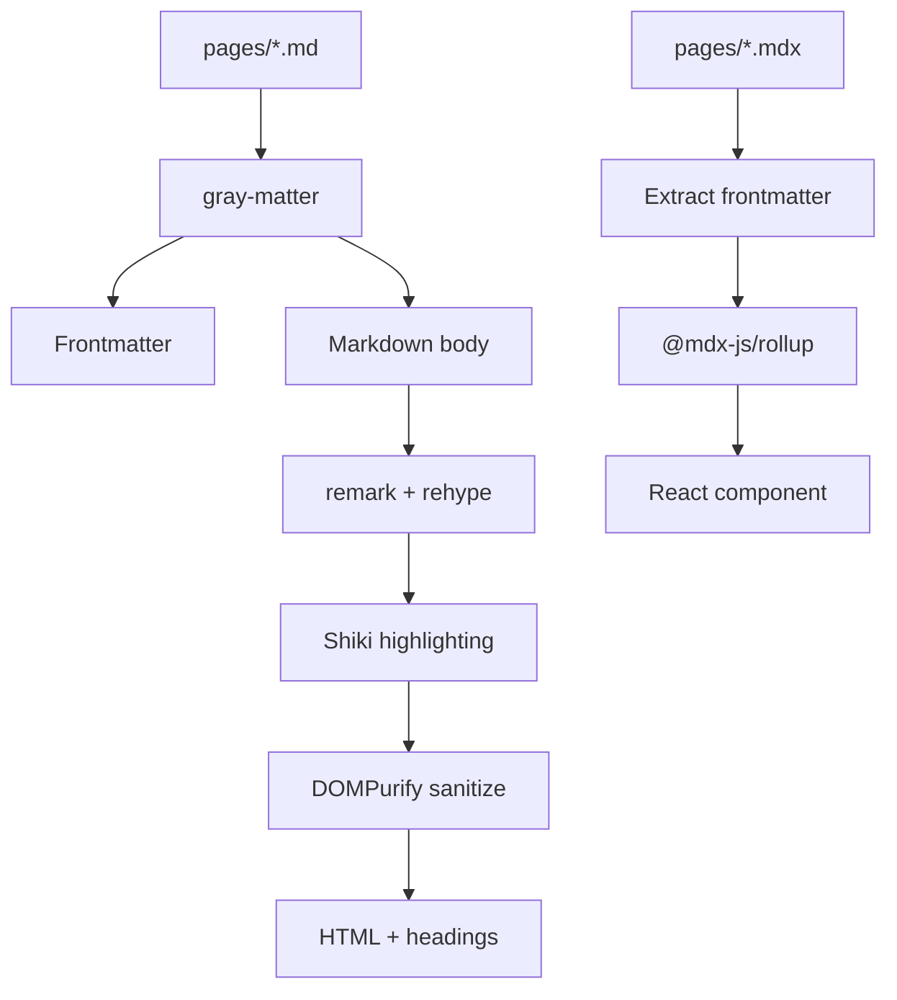

Tome is built on Vite and React. Understanding the architecture helps when debugging build issues or building advanced customizations.

## Overview

A Tome site is a Vite application with a custom plugin that handles page discovery, routing, and content processing. The theme package provides the React UI shell.



## Vite plugin

The core of Tome is `vite-plugin-tome` in `@tomehq/core`. It has three responsibilities:

**1. Page discovery** — On startup, the plugin scans `pages/` for `.md` and `.mdx` files, extracts frontmatter, and builds a route table. It watches for file changes during development and triggers hot reloads.

**2. Virtual modules** — The plugin exposes content through Vite's virtual module system:

| Module | Contents |
|--------|----------|
| `virtual:tome/config` | The resolved config as JSON |
| `virtual:tome/routes` | Route table with IDs, URLs, and frontmatter |
| `virtual:tome/page/:id` | Processed page content |
| `virtual:tome/api` | Parsed OpenAPI manifest |
| `virtual:tome/analytics` | Analytics provider settings |

**3. Build-time generation** — During builds, the plugin injects analytics scripts and generates the `mcp.json` manifest.

## Theme system

The theme package (`@tomehq/theme`) provides the React shell:

- **Shell component** — Header, sidebar, content area, footer
- **Preset system** — Color tokens and CSS variables per preset
- **Search integration** — Pagefind or Algolia, loaded dynamically
- **AI chat** — Optional floating widget

The entry point (`.tome/entry.tsx`) bootstraps the shell by importing `@tomehq/theme/entry`.

## Content pipeline



### Markdown (`.md`)

1. Frontmatter extracted via `gray-matter`
2. Markdown processed through remark (GFM, math) and rehype (slugs, autolink headings)
3. Code blocks highlighted with Shiki (mermaid blocks converted to client-side placeholders)
4. HTML sanitized with DOMPurify, headings extracted for table of contents
5. HTML + headings + frontmatter served as virtual module

### MDX (`.mdx`)

1. Frontmatter and headings extracted from raw source
2. File passed to `@mdx-js/rollup` for JSX compilation
3. Virtual module re-exports the compiled React component + metadata

## Build output

```text
out/
├── index.html           # SPA entry
├── assets/
│   ├── index-[hash].js  # Application bundle
│   └── index-[hash].css # Styles
├── _pagefind/           # Search index
├── mcp.json             # MCP manifest
├── llms.txt             # AI-readable page index
├── llms-full.txt        # Full page content for LLMs
└── 404.html             # Error page
```

The output is a single-page application. Search is fully static. The `llms.txt` and `llms-full.txt` files are auto-generated at build time to make your documentation discoverable by AI tools and language models.

## Package structure

| Package | Purpose |
|---------|---------|
| `@tomehq/cli` | CLI commands (init, dev, build, deploy) |
| `@tomehq/core` | Config, routing, Vite plugin, markdown processing |
| `@tomehq/theme` | Shell UI, presets, search, AI chat |
| `@tomehq/components` | MDX components (Callout, Tabs, Card, etc.) |
