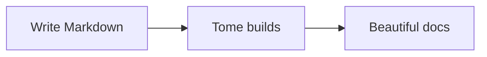
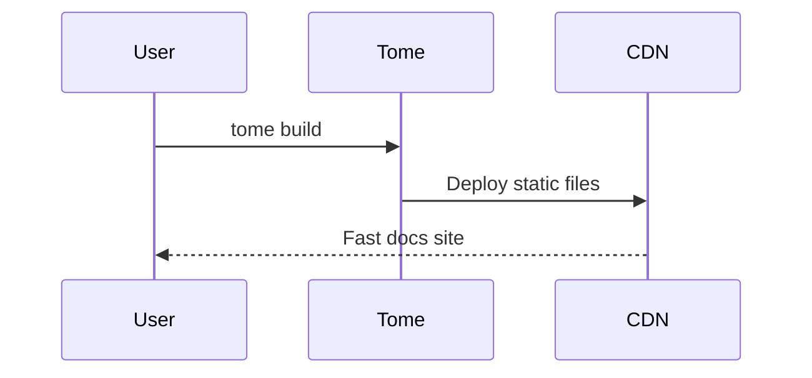

All site configuration lives in `tome.config.js` (or `.mjs` / `.ts`) at your project root. Tome validates the config with Zod and provides clear error messages if anything is wrong.

## Minimal config

```javascript
export default {
  name: "My Docs",
};
```

This is all you need. Tome uses sensible defaults for everything else.

## Site metadata

```javascript
export default {
  name: "My Docs",
  logo: "/logo.svg",        // Path relative to public/
  favicon: "/favicon.ico",  // Path relative to public/
  baseUrl: "https://docs.example.com",
};
```

`baseUrl` is used for generating canonical URLs and analytics endpoints. It should be the full URL where your site is hosted.

## Navigation

The `navigation` array defines your sidebar structure. Each group has a label and a list of page IDs (filenames without extensions):

```javascript
navigation: [
  {
    group: "Getting Started",
    pages: ["index", "quickstart"],
  },
  {
    group: "API",
    pages: ["api/authentication", "api/endpoints", "api/errors"],
  },
],
```

Pages not listed in navigation still exist at their URL — they're just hidden from the sidebar.

### Nested groups

Groups can be nested for complex documentation structures:

```javascript
navigation: [
  {
    group: "SDK",
    pages: [
      "sdk/overview",
      {
        group: "Languages",
        pages: ["sdk/javascript", "sdk/python", "sdk/go"],
      },
    ],
  },
],
```

## Top navigation

Add links to the header bar:

```javascript
topNav: [
  { label: "Blog", href: "https://blog.example.com" },
  { label: "Changelog", href: "/changelog" },
],
```

## Theme

```javascript
theme: {
  preset: "editorial",   // "amber" or "editorial"
  accent: "#ff6b4a",     // Custom accent color (hex)
  mode: "auto",          // "light", "dark", or "auto"
  fonts: {
    heading: "Playfair Display",
    body: "Source Sans Pro",
    code: "Fira Code",
  },
},
```

See **[Theming](#theming)** for full customization details.

## Base path

If your docs are served under a subpath (e.g., `example.com/docs/`), set `basePath`:

```javascript
basePath: "/docs/",
```

This configures Vite's `base` option so all asset paths resolve correctly.

## Search

Pagefind is enabled by default with no configuration. To use Algolia DocSearch instead:

```javascript
search: {
  provider: "algolia",
  appId: "YOUR_APP_ID",
  apiKey: "YOUR_SEARCH_KEY",
  indexName: "your-index",
},
```

## Banner

Display an announcement banner at the top of every page:

<Callout type="tip" title="Live example">
  Look at the top of this page — the coral banner saying "New in v3" is a live banner configured in this site's `tome.config.js`.
</Callout>

```javascript
banner: {
  text: "v2.0 is now available!",
  link: "/changelog",         // Optional — makes the text a link
  dismissible: true,          // Default: true — shows a close button
},
```

When a user dismisses the banner, it stays hidden until you change the text. Updating the `text` value automatically shows the banner again for all users.

## Math rendering

Use ` ```math ` fenced code blocks for display math in both `.md` and `.mdx` files:

```math
E = mc^2
```

```math
\int_{-\infty}^{\infty} e^{-x^2} dx = \sqrt{\pi}
```

Math is rendered client-side with KaTeX loaded from CDN — no dependencies to install, no config flag needed. Just write the code block and it works.

For `.md` files, you can also enable inline math with `$E = mc^2$` and display math with `$$` blocks by setting:

```javascript
math: true,
```

## Mermaid diagrams

Mermaid diagrams work out of the box with no configuration. Use a `mermaid` code fence in any `.md` or `.mdx` file:





Diagrams are rendered client-side and automatically adapt to your site's light/dark theme. Colors, labels, and borders adjust for both light and dark mode with proper contrast.

## Agent-friendly output

Tome automatically generates six machine-readable files at build time — no configuration needed:

| File | Description |
|------|-------------|
| `llms.txt` | Page index with titles, descriptions, and URLs |
| `llms-full.txt` | Full raw Markdown content of all non-hidden pages |
| `skill.md` | Agent capability file — site structure, available resources, and usage instructions |
| `robots.txt` | Crawler directives — explicitly allows AI crawlers (GPTBot, ClaudeBot, PerplexityBot, etc.) |
| `search.json` | Structured page index with titles, headings, tags, and word counts |
| `mcp.json` | MCP manifest with page metadata, headings, and optional content |

Every HTML page also gets **JSON-LD schema markup** injected into the `<head>`:
- `WebSite` schema on the homepage (with `SearchAction`)
- `TechArticle` schema on each documentation page

Hidden pages (with `hidden: true` in frontmatter) are excluded from all generated files.

## Full example

```javascript
export default {
  name: "Acme Docs",
  logo: "/acme-logo.svg",
  favicon: "/favicon.ico",
  baseUrl: "https://docs.acme.com",
  theme: {
    preset: "editorial",
    accent: "#2563eb",
    mode: "auto",
  },
  navigation: [
    { group: "Overview", pages: ["index", "quickstart"] },
    { group: "Guides", pages: ["guides/auth", "guides/deploy"] },
    { group: "API", pages: ["api/rest", "api/webhooks"] },
  ],
  topNav: [
    { label: "Changelog", href: "/changelog" },
  ],
  search: { provider: "local" },
  banner: {
    text: "v2.0 is now available!",
    link: "/changelog",
    dismissible: true,
  },
  math: true,
};
```
