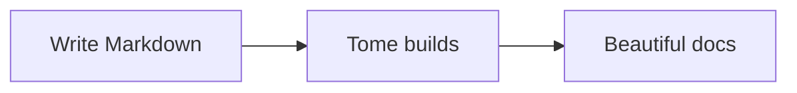
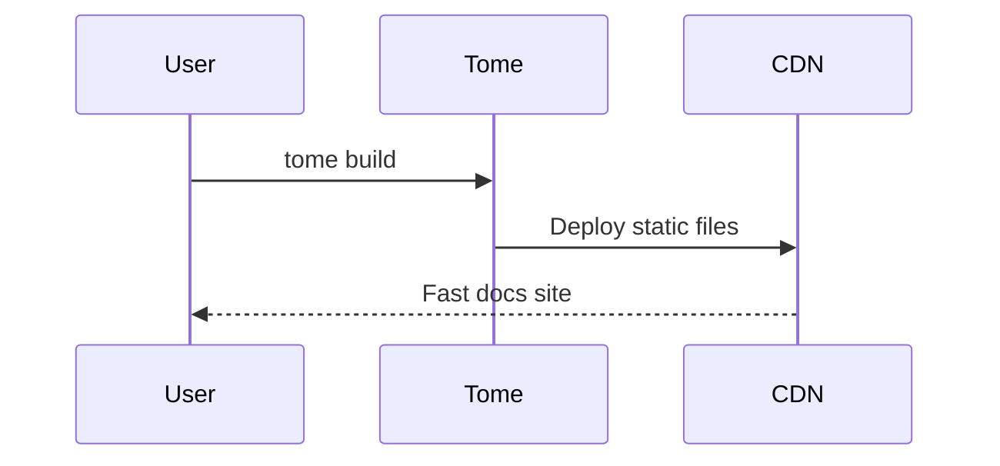

All site configuration lives in `tome.config.js` (or `.mjs` / `.ts`) at your project root. Tome validates the config with Zod and provides clear error messages if anything is wrong.

## Minimal config

```javascript
export default {
  name: "My Docs",
};
```

This is all you need. Tome uses sensible defaults for everything else.

## Site metadata

```javascript
export default {
  name: "My Docs",
  logo: "/logo.svg",        // Path relative to public/
  favicon: "/favicon.ico",  // Path relative to public/
  baseUrl: "https://docs.example.com",
};
```

`baseUrl` is used for generating canonical URLs and analytics endpoints. It should be the full URL where your site is hosted.

## Navigation

The `navigation` array defines your sidebar structure. Each group has a label and a list of page IDs (filenames without extensions):

```javascript
navigation: [
  {
    group: "Getting Started",
    pages: ["index", "quickstart"],
  },
  {
    group: "API",
    pages: ["api/authentication", "api/endpoints", "api/errors"],
  },
],
```

Pages not listed in navigation still exist at their URL — they're just hidden from the sidebar.

### Nested groups

Groups can be nested for complex documentation structures:

```javascript
navigation: [
  {
    group: "SDK",
    pages: [
      "sdk/overview",
      {
        group: "Languages",
        pages: ["sdk/javascript", "sdk/python", "sdk/go"],
      },
    ],
  },
],
```

## Top navigation

Add links to the header bar:

```javascript
topNav: [
  { label: "Blog", href: "https://blog.example.com" },
  { label: "GitHub", href: "https://github.com/example/docs" },
],
```

## Theme

See the [Custom theme guide](./guides/custom-theme) for full details.

```javascript
theme: {
  preset: "editorial",   // "amber" or "editorial"
  accent: "#ff6b4a",     // Custom accent color (hex)
  mode: "auto",          // "light", "dark", or "auto"
  fonts: {
    heading: "Playfair Display",
    body: "Source Sans Pro",
    code: "Fira Code",
  },
},
```

## Base path

If your docs are served under a subpath (e.g., `example.com/docs/`), set `basePath`:

```javascript
basePath: "/docs/",
```

This configures Vite's `base` option so all asset paths resolve correctly.

## Banner

Show an announcement at the top of every page:

<Callout type="tip" title="Live example">
  Look at the top of this page — the coral banner saying "New in v3" is a live banner configured in this site's `tome.config.js`.
</Callout>

```javascript
banner: {
  text: "We just launched v2.0!",
  link: "/changelog",       // Optional — wraps text in a link
  dismissible: true,        // Default true — shows close button
},
```

The banner uses your accent color as its background. When a user dismisses it, a hash of the text is saved to localStorage. Change the text to show the banner again for all users.

## Math / KaTeX

Use ` ```math ` fenced code blocks for display math in both `.md` and `.mdx` files:

```math
E = mc^2
```

```math
\int_{-\infty}^{\infty} e^{-x^2} dx = \sqrt{\pi}
```

Math is rendered client-side with KaTeX loaded from CDN — no dependencies to install, no config flag needed. Just write the code block and it works.

For `.md` files, you can also enable inline math with `$...$` and display math with `$$...$$` blocks by setting:

```javascript
math: true,
```

## Mermaid diagrams

Mermaid diagrams require no configuration. Use a `mermaid` code fence in any page:





Mermaid is loaded from a CDN on demand — no install needed. Diagrams adapt to your light/dark theme automatically.

## AI discoverability (llms.txt)

At build time, Tome automatically generates:

- **`llms.txt`** — Page index with titles, descriptions, and URLs
- **`llms-full.txt`** — Complete Markdown content of every non-hidden page

No configuration needed. Hidden pages (frontmatter `hidden: true`) are excluded. These files help AI assistants and language models understand your documentation.

## Full example

```javascript
export default {
  name: "Acme Docs",
  logo: "/acme-logo.svg",
  favicon: "/favicon.ico",
  baseUrl: "https://docs.acme.com",
  theme: {
    preset: "editorial",
    accent: "#2563eb",
    mode: "auto",
  },
  navigation: [
    { group: "Overview", pages: ["index", "quickstart"] },
    { group: "Guides", pages: ["guides/auth", "guides/deploy"] },
    { group: "API", pages: ["api/rest", "api/webhooks"] },
  ],
  topNav: [
    { label: "GitHub", href: "https://github.com/acme/docs" },
  ],
  search: { provider: "local" },
};
```

See the [Config reference](./reference/config) for every available field.
